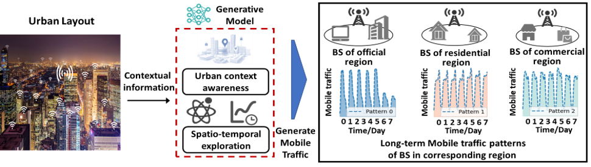
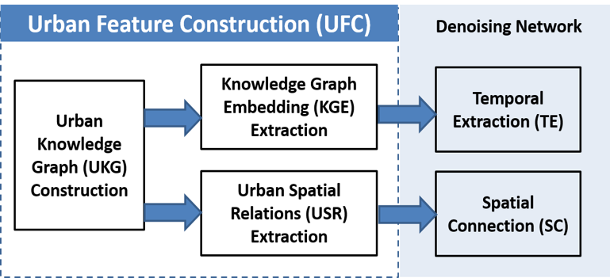
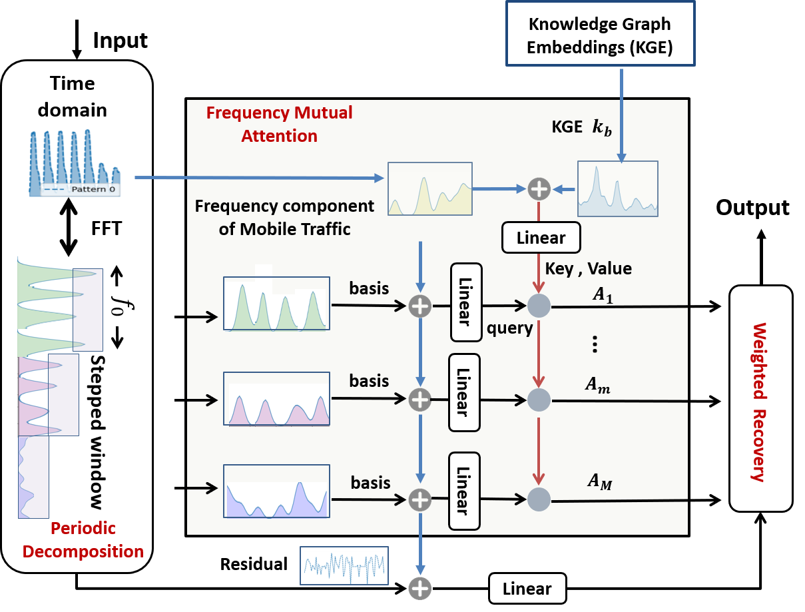
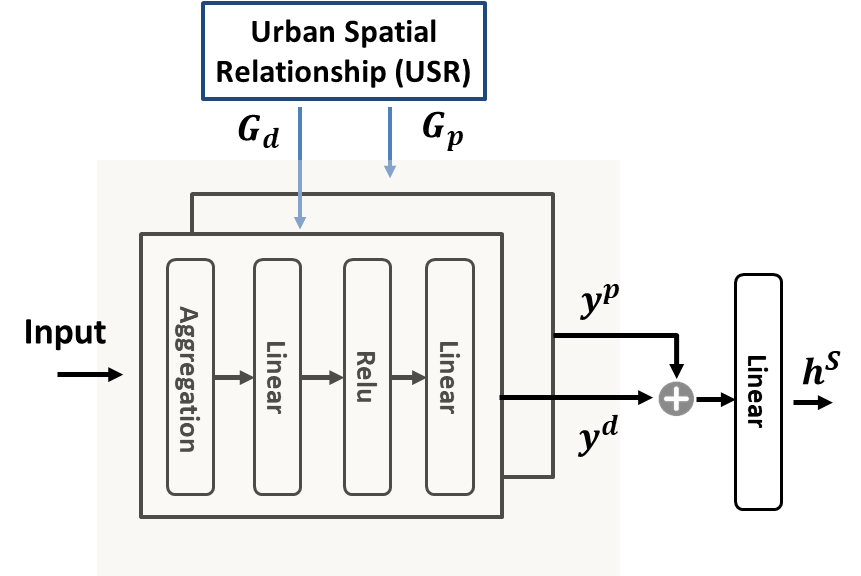

# STK-Diff
## The source code of our paper "Spatio-Temporal Knowledge driven Diffusion Model for Mobile Traffic Generation", IEEE Transactions on Mobile Computing (IEEE TMC)

---

### Environment
* Tested OS: Linux
* Python >= 3.7
* PyTorch == 1.10.2+cu111
* dgl == cu110-0.6.1

---

### Quick start
1. We provide a part of the dataset from the paper, which is the aggregated 5G traffic data of base stations in a specific area of Beijing, China. You can directly load it using `np.load('traffic_data/bs_beijing.npz')['bs_record']`.
2. We provide a pre-trained urban knowledge graph, which corresponds to the embedding of each base station. You can directly load it using `np.load('traffic_data/bs_beijing.npz')['bs_kge']`.
3. We provide a multi-dimensional spatial graph of base stations constructed based on distance and POI distribution. You can load it using `np.load('citydata/dis_nor_beijing.npz')['res']` and `np.load('citydata/poi_nor_beijing.npz')['res']`.
4. Create a new "save" folder to store the result data. You can then train and validate the model by running `python stkdiff_main.py`.

---

### Train your own dataset

1. Replace your own traffic/spatiotemporal dataset with the shape of `Batchsize * T` (in our paper, we use a length of 168).
2. The Urban Knowledge Graph (UKG) is an array of shapes `Batchsize * Feature_size`, which can be constructed by referring to our work [UrbanKG: An Urban Knowledge Graph System](https://dl.acm.org/doi/abs/10.1145/3588577).
3. The spatiotemporal relationship graph consists of two weighted adjacency matrices of shape `Batchsize * Batchsize`.

---

* ### The framework and flowchart of our proposed STK-Diff

  

  <strong>The framework of STK-Diff</strong>

  

  <strong>The flowchart of STK-Diff</strong>

<table>
  <tr>
    <td align="center"></td>
    <td align="center"></td>
  </tr>
  <tr>
    <td align="center"><strong>TE-module</strong></td>
    <td align="center"><strong>SC-module</strong></td>
  </tr>
</table>

